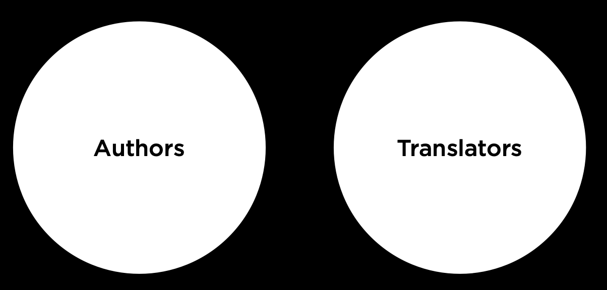
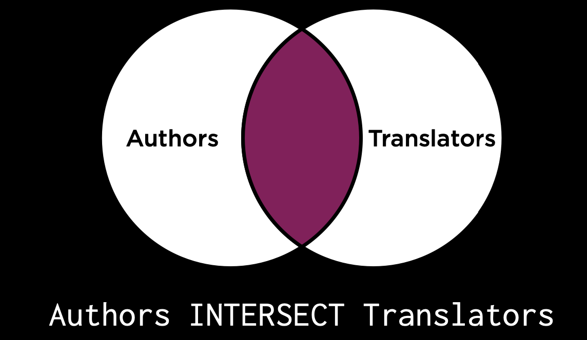
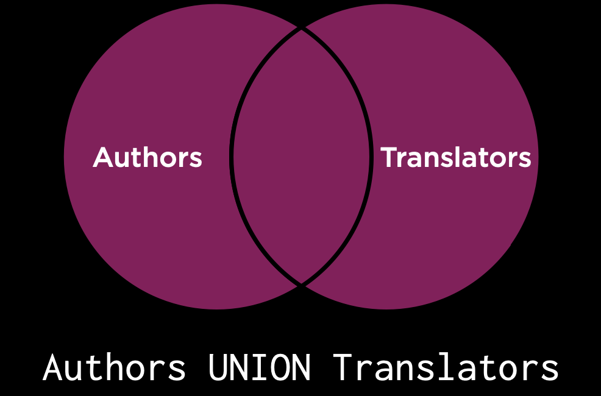
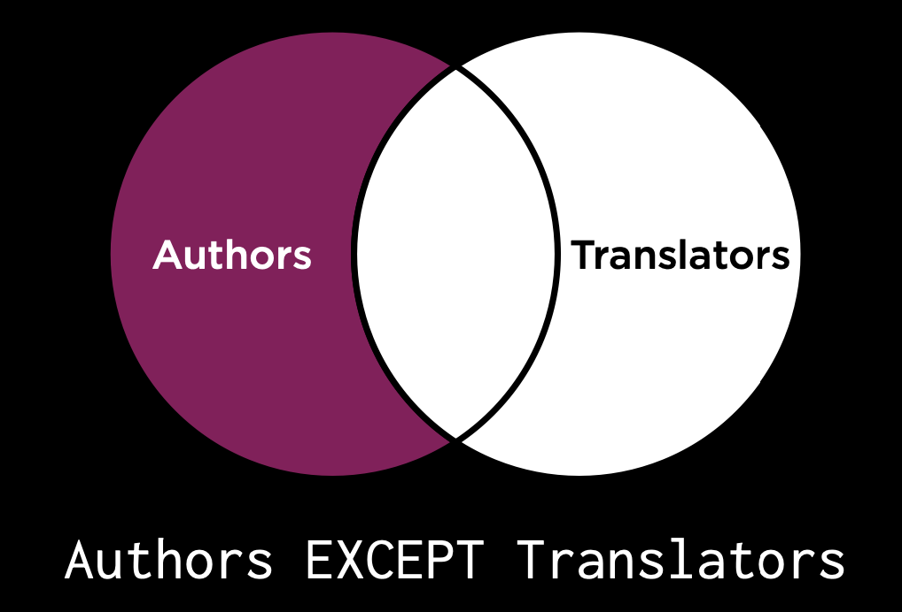
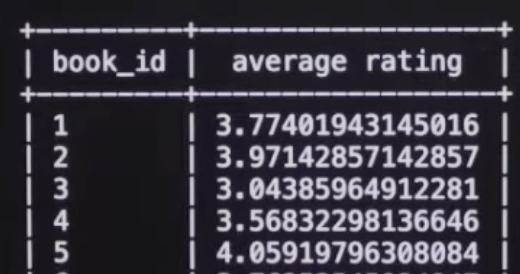

# Lecture 1 - Relating

## how to see tables:

For SQLite - `.tables`

## Entity Relationship Diagrams

- aka ER diagrams
- our book data base may look like this:
  

### what lines mean in ERs


Based on this, we can look at this part of the diagram and read it as such:


- A book has: zero, or many reviews.
- A rating belongs to one (and only one) book.

## primary keys

- a book isbn is like a primary key. it is a way of identifying a specific book, that specifies things like:
  - its author
  - its edition
  - softcover/hardcover
  - year of publish
  - etc...

## foreign keys

- are just another table's pks in another table.


Here, the isbn is a PK on "books", and a foreign key on "ratings".

- but storing all these as isbns may take up more space than we really need.
- therefore, why dont we just start our 'own' isbn ... with 1.


For a many-to-many:


# Subqueries

How can I get all the books Fitzcarraldo published?


1. first need to figure out the id of Fitz:

```sql
SELECT "id" FROM "publishers"
WHERE "publishers" = 'Fitzcarraldo Editions';
```

which would return 5.

2. then we use this id to get the book names:

```sql
SELECT "title" FROM "books"
WHERE "publisher_id" = 5;
```

But notice how bad the hard coded 5 looks. Instead we can do subqueries, using parans to make sure the orer of execution:

```sql
SELECT "title" FROM "books"
WHERE "publisher_id" = (
  SELECT "id" from "publishers"
  WHERE "publishers" = 'Fitzcarraldo Editions';
);
```

note: if the subQ returns null, the outer will return null (luckily it would just crash)
note: the outer query / what you start with is what you ultimately want to return. the final result.

Q: What is the average rating for the book 'In Memory of Memory' ?

A:

```sql
SELECT AVG("rating") FROM "ratings"
WHERE "book_id" = (
  SELECT "id" FROM "books"
  WHERE "title" = 'In Memory of Memory'
);
```

## subqueries for m-m


Q: Which author(s) wrote 'Flights'?
A:
psudeocode:

1. book id of 78.
2. need to find the author_id(s) associate with a book_id of 78. That is 58.
3. need to find the name of the author with that author_id of 58.

---

1.

```sql
SELECT "id" FROM "books"
  WHERE "title" = 'Flights';
```

2.

```sql
SELECT "author_id" FROM "authored"
  WHERE "book_id" = (
    -- query 1:
    SELECT "id" FROM "books" WHERE "title" = 'Flights'
  );
```

3.

```sql
SELECT "name" FROM "authors"
  WHERE "id" = (
    -- query 2:
    SELECT "author_id" FROM "authored"
      WHERE "book_id" = (
        SELECT "id" FROM "books" WHERE "title" = 'Flights'
    )
  );
```

Note: this only works because there is only one author for Flights. If there had been more, we cannot do the query of id = (23, 56) for example.
In stead we need to use a keyword instead of = , which is...

## `IN`

- if there is a possibility for a subquery to return multiple results (thus, a set) we need to use `IN` and parans.

```sql
SELECT "title" FROM "books" WHERE "id" IN (
  SELECT "book_id" FROM "authored" WHERE "author_id" = (
    SELECT "id" FROM "authors" WHERE "name" = 'Fernanda Melchor'
  )
);
```

Returns Fernanda's books.

# Joins

For this, let's instead look at sea lions, and their migrations along the californian coast.


You could do subqueries. but likely, a researcher is gonna go this subq a LOT so it may make the most sense to have the data live on one table together, using the sea lion ids.

```sql
SELECT * FROM "sea_lions"
  JOIN "migrations"
  ON "migrations"."id" = "sea_lions"."id";
```

result:


Simplified version of the two tables:


## INNER JOIN

the pink and blue do not get included.
An inner join results in this:


- this is the 'usual' join.
- if we have data that doesnt match up, it doesnt get included.
  - jolee doesnt have any migration data. so she is not included.
  - the migration data without a name does not get included.

## LEFT JOIN

- "prioritizes" the "left" table (aka the first table you started with)
- you can see Jolee is here, but just has nothing in the cols that she was not found in for the migrations table.


```sql
SELECT * FROM "sea_lions"
  LEFT JOIN "migrations" ON "migrations"."id" = "sea_lions"."id";
```

## RIGHT JOIN


```sql
SELECT * FROM "sea_lions"
  RIGHT JOIN "migrations" ON "migrations"."id" = "sea_lions"."id";
```

## FULL JOIN


## OUTER vs INNER

- the three above are OUTER joins.

## NATURAL JOIN

- if there are cols of the same name in both tables, will _naturally_ join on them.

---

# Sets

Say in the book industry, You have authors and translators.


## INTERSECTS



## UNION



## EXCEPT



## writing the set queries

Q: get all authors and translators
A:

```sql
SELECT "name" FROM "translators"
  UNION
  SELECT "name" FROM "authors";
```

Q: same as above but differentiate who is what.
A: creates a new col using `'rowdata' as "colname"`

```sql
SELECT 'author' as "profession", "name" FROM "translators"
  UNION
  SELECT 'translator' as "profession", "name" FROM "translators";
```

Q: get people who are both authors AND translators.

```sql
SELECT "name" FROM "translators"
  INTERSECT
  SELECT "name" FROM "authors";
```

Q: Get books that Sophie Hughes and Margaret Jull Costa' have translated together on.

Step 1. get books Sophie Hughes has translated.

```sql
SELECT "book_id" FROM "translated"
  WHERE "translator_id" = (
    SELECT "id" FROM "translators" WHERE name = 'Sophie Hughes'
  );
```

Step 2. get books Margaret Jull Costa has translated.

```sql
SELECT "book_id" FROM "translated"
  WHERE "translator_id" = (
    SELECT "id" FROM "translators" WHERE name = 'Margaret Jull Costa'
  );
```

Step 3. `INTERSECT` them

```sql
SELECT "book_id" FROM "translated"
  WHERE "translator_id" = (
    SELECT "id" FROM "translators" WHERE name = 'Sophie Hughes'
  )
  INTERSECT
  SELECT "book_id" FROM "translated"
    WHERE "translator_id" = (
      SELECT "id" FROM "translators" WHERE name = 'Margaret Jull Costa'
    );
```

this gives us the book id 50.

NOTE: you can only intersect things that are of the same data type

# GROUP BY

Q: how to get the average ratings of a book... per book?
A:

```sql
SELECT "book_id", AVG("rating") AS "average rating"
  FROM "ratings"
  GROUP BY "book_id"
```



Q: how to get the average ratings of a book... per book?
A:

```sql
SELECT "book_id", ROUND(AVG("rating"), 2) AS "average rating"
  FROM "ratings"
  GROUP BY "book_id"
  -- cannot do: WHERE "average rating" > 4.0
  -- this is because WHERE only works for column names.
  -- for groups, you must use...
  HAVING "average rating" > 4.0;
```

Q: Same as above but max->min average rating.
A:

```sql
SELECT "book_id", ROUND(AVG("rating"), 2) AS "average rating"
  FROM "ratings"
  GROUP BY "book_id"
  -- cannot do: WHERE "average rating" > 4.0
  -- this is because WHERE only works for column names.
  -- for groups, you must use...
  HAVING "average rating" > 4.0
  ORDER BY "average rating" DESC;
```

Q: How many ratings there are per book
A:

```sql
SELECT "book_id", COUNT("rating") AS "number of ratings"
  FROM "ratings"
  GROUP BY "book_id";
```

---

Q: how to get the average ratings of a book... per book, with the bookname.
A:

```sql
SELECT "books"."title", "book_id", ROUND(AVG("rating"), 2) AS "average rating"
  FROM "ratings"
  JOIN "books" ON "books"."id" = "ratings"."book_id"
  GROUP BY "book_id"
  HAVING "average rating" > 4.0
  ORDER BY "average rating" DESC
  ;
```

A:

Step 1: this would get us the ids of authors

```sql
SELECT "author_id" FROM "authors"
  WHERE "name" IN ('Jon Fosse', 'Fernanda Melcor')
```

Q: Get the names of authors who have written more than 1 book.
A:

```sql
  SELECT "authors"."name", COUNT(*) AS "book_count"
    FROM "authors"
      JOIN "authored"
        ON "authors"."id" = "authored"."author_id"
    GROUP BY "authors"."name"
    HAVING "book_count" > 1
    ORDER BY "book_count" DESC;
```

Q: Books published between 2017 and 2018

```sql
SELECT "title", "published" FROM "books"
  WHERE "published" BETWEEN '2017-%' AND '2019-%';
```

(keep in mind exclusive, it goes until just before the very first day of 2019)
