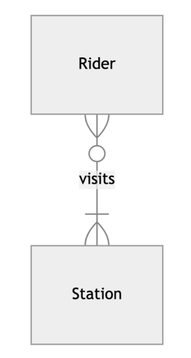
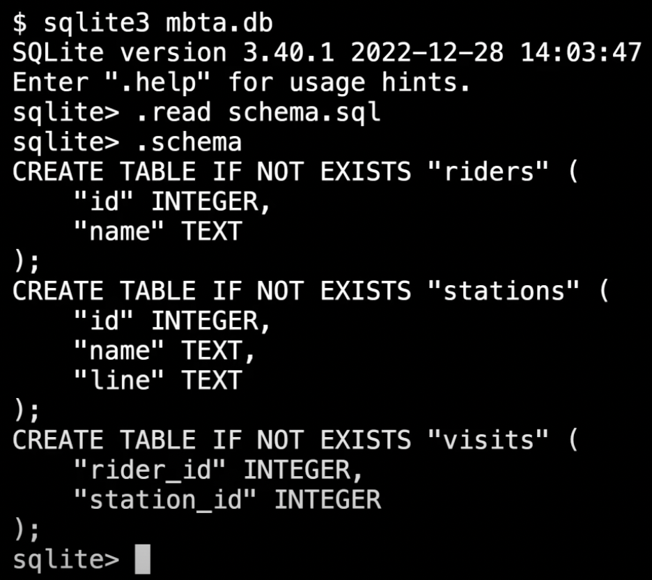

# lec 2 - design

- for SQLite, `.schema tableName` will give you the schema for that specific table.

## Normalizing Data

- **Normalizing** means to reduce redundencies, having each entity being its own table, eg author names being their own table.
- Do this by giving each entity their own table, eg riders are their own. stations are their own.

## figuring out associations

- one rider could get ON at one station, and OFF at another.
- one station has many riders
  - you can argue this is a m2m.



## creating tables

- `sqlite mbta.db`
  - prompts you if you want to create a db called mbta.db
- make table for riders, and stations

```sql
CREATE TABLE "riders" (
  "id",
  "name"
);
```

```sql
CREATE TABLE "riders" (
  "id",
  "name",
  "line"
);
```

- typing `.schema` will now reveal the tables

## relating the tables via a junction/join table

- for the m2m relation between riders and stations:

```sql
CREATE TABLE "visits" (
  "rider_id",
  "station_id"
);
```

## data types VS storage classes

### SQLite storage classes:

- NULL
- INTEGER
- REAL
- TEXT
- BLOB (binary large object, usually images or videos)

Each Storage Class has various data types.
For example, integers have...

- 0-byte integer
- 1-byte integer
- 2-byte integer
- 3-byte integer
- 4-byte integer
- 6-byte integer
- 8-byte integer

SQLite will decide by itself which is appropriate to use.

What to do about the `line` field on station? -> TEXT
What about a map.jpg? -> BLOB

What about fares? Here, we have a choice.

- 10 as an integer? Hard to read
- $0.10 as text? But now we can't add/do math with a number...
- 0.10 as a REAL? But there will still be issues with how these numbers are stored with decimals.

## Type Affinities

- in SQLite: associated with individual columns
  - TEXT
  - NUMERIC
  - INTEGER
  - REAL
  - BLOB

if you have `25` and insert it into a column with a text affinity, it inserts it as `"25"`

- conversely, `"10"` inserted into a column with a INT affinity, inserts as `10`

## deleting the table

```sql
DROP TABLE "riders";
DROP TABLE "visits";
DROP TABLE "stations";
```

## Redoing our tables with storage classes

- make a new file called `schema.sql` (also included in this folder)
- it looks like:

```sql
CREATE TABLE "riders" (
  "id" INTEGER,
  "name" TEXT
);
CREATE TABLE "stations" (
  "id" INTEGER,
  "name" TEXT, --Park Street
  "line" TEXT, --Red line
);
CREATE TABLE visits (
  "rider_id" INTEGER,
  "station_id" INTEGER
)
```

### applying the schema.sql create tables to the db

- `sqlite3 mbta.db` (open the database)
- "read in" the file -> `.read schema.sql`
- `.schema` now you can see the tables are there!



#### what about bools?

sqlite doesnt have has bools, you just use ints for 0 or 1

## Table Constraints

- you can apply a constraint to the entire table. A constraint is when a value has to be a certain 'way'
  - eg primary keys must be unique, and in our case, integers
    `PRIMARY KEY` AND `FOREIGN KEY` are two constraints we can apply. Using these We now have...

### Primary Key Constraint

In the table created, AFTER ALL the cols, the constraint is applied like so:

```sql
CREATE TABLE "riders" (
  "id" INTEGER,
  "name" TEXT,
  PRIMARY KEY("id")
);
```

### Foreign Key Constraint

Looks similar to how PK is applied, but just saying `FOREIGN KEY("rider_id")` is not enough.

- We need to tell it the table (and col in that table) it `REFERENCES`s

```sql
FOREIGN KEY("other_id") REFERENCES "tableName"("columnName")
```

```sql
CREATE TABLE visits (
  "rider_id" INTEGER,
  "station_id" INTEGER,
  -- the PK for visits is auto-generated by sqlite, it is not explicitly typed here.
  -- because rider_id and station_id both reference PKs on other tables, they are BOTH foreign keys.
  FOREIGN KEY("rider_id") REFERENCES "riders"("id"), -- REFERENCES "tableName"("columnName")
  FOREIGN KEY("station_id") REFERENCES "stations"("id")
);
```

## Column Constraints

We can also apply constraints on columns:

- CHECK
  - check to be sure (some expression) such as, is greater than 0.
- DEFAULT
  - if a value is not supplied when a new row is inserted, insert this for the default value.
- NOT NULL
- UNIQUE

These are keywords that are given on the same line as the column declaration, such as:

```sql
  "email" TEXT UNIQUE NOT NULL,
```

- Note: once you apply the PRIMARY KEY constraint, this requires the pk to be not null, so there is no need to put things like NOT NULL on the "id" col.
- Same goes for the Foreign keys constraints.
